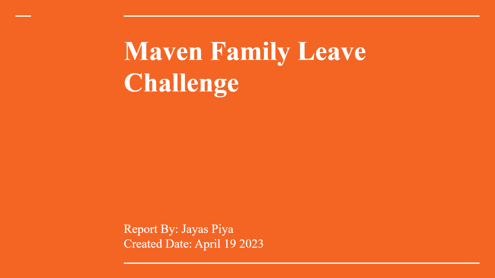
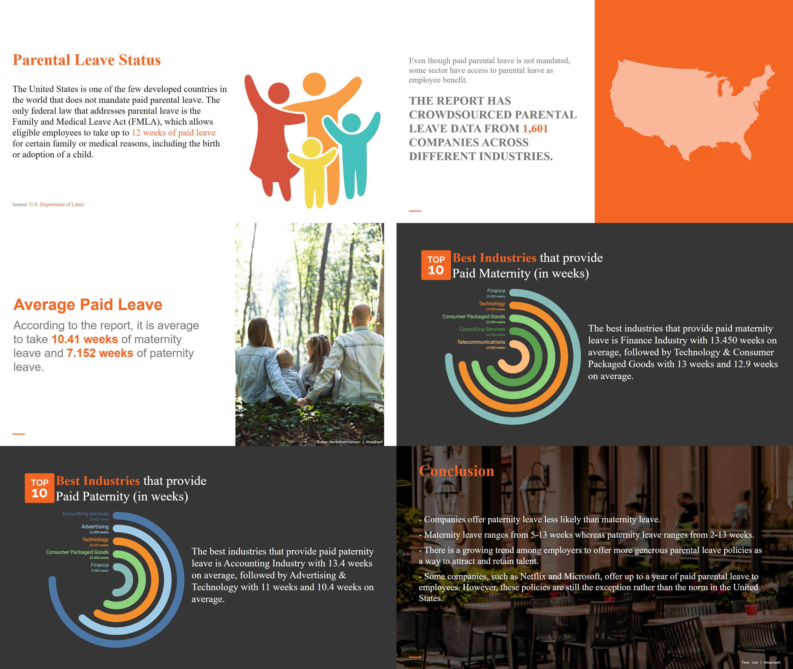

# Maven Family Leave Challenge

For this challenge, you'll be working as a Data Visualization Specialist at an online business journal. Your role is to create charts, visuals, and infographics as supporting content for articles.

Crowdsourced parental leave data from 1,601 companies across different industries, including paid/unpaid maternity and paternity leave weeks.

## Project Summary

The project involved analyzing crowdsourced parental leave data from 1,601 companies across different industries, including paid and unpaid maternity and paternity leave weeks. The data was originally contained within a single table in CSV format, consisting of 6 fields and 1601 records. To ensure the accuracy and consistency of the data, provided data dictionary was used to guide the overall analysis.

The data was processed using Databricks Medallion Architecture in PostgreSQL to manage and transform the data into a structured format. Finally, a data visualization presentation was created in Tableau to showcase the key insights and trends identified from the data. The project provides valuable insights into the state of parental leave policies in the United States, highlighting opportunities for improvement.

## Objective

The objective of the presentation was to identify the industry with the best paid parental leave policies. The presentation focused solely on this goal, without introducing extraneous details or complexity. By adopting a straightforward approach, the findings were aimed to communicated effectively to give clear and actionable insight.

## Databricks Medallion Architecture

In the Databricks Medallion architecture, the Bronze, Silver, and Gold tables are part of a data ingestion and processing pipeline that enables organizations to extract value from their data.

Databricks Medallion Architecture has three main layers to enables organizations to extract value from their data.

**Bronze layer**: This is the first layer in the data pipeline, where raw data is ingested and stored in its original form. The bronze layer is typically used for data exploration, where data scientists can perform preliminary analyses and gain insights into the data.

**Silver layer**: In the silver layer, data is transformed and structured into a more usable form for downstream analysis. It is designed to support complex queries and analytical workflows.

**Gold layer**: The gold layer is the final layer in the data pipeline, where high-quality data is stored in a structured form that is optimized for efficient querying and reporting.

Learn more about Medallion Architecture in https://www.databricks.com/glossary/medallion-architecture

## Data Processing Workflow

In the project, raw data was ingested in the bronze table with string as data type for all fields.

To load the data to silver table, data types were specified and to make the data more meaningful, industry type and sub industry type were separated from industry field from bronze table.

Finally, Aggregated data was processed to calculate the average paid and unpaid leave for both parents and loaded into the gold table.

The process involved data transformation from the bronze table to the silver and gold tables resulting in structured and enriched data in the gold table.

> You can follow the scripts folder to learn more about data processing.

## Insights Presentation

